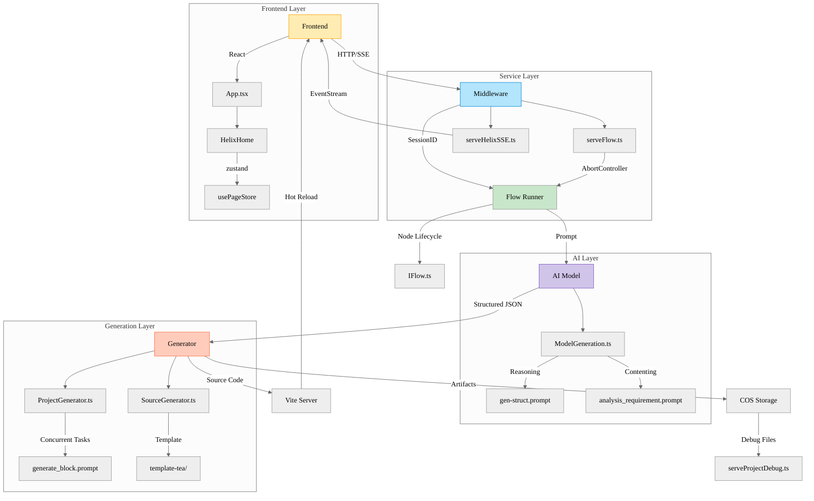

# Helix-AI 工程师

## 模块分析

我来为你详细分析这个代码库的架构设计和模块关系。这是一个基于Node.js的全栈项目，主要功能是AI辅助的前端代码生成系统。以下是各模块的详细分析：

### 1. 模块关系和数据流转



### 1.1 `fegen` (前端生成模块)

- **功能**：前端代码生成核心逻辑
- 关键文件：
  - `backend-sample.json`：展示课程表管理系统的生成示例
  - `gen.ts`：需求分析入口，调用AI模型分析需求
- **职责**：
  - 解析用户需求文档
  - 生成API协议和前端区块设计
  - 输出结构化JSON(包含API定义和区块代码)

### 1.2 `ai` (AI模块)

- **核心文件**：`ModelGeneration.ts`
- **职责**：
  - 封装OpenAI API调用
  - 提供流式生成能力
  - 支持调试日志记录
  - 处理prompt模板和输入替换
- **特点**：
  - 使用`deepseek-r1-local-III`模型
  - 支持生成过程的事件流(connected/reasoning/contenting等)

### 1.3 `frontend` (前端模块)

- **技术栈**：React + TypeScript + Vite
- **核心功能**：
  - 提供用户交互界面
  - 展示生成过程和结果
  - 包含登录、预览等基础功能
- **特点**：
  - 使用腾讯内部`tea-component`UI库
  - 支持SSE实时通信

### 1.4 `generator` (代码生成器)

- **核心文件**：`ProjectGenerator.ts`和`SourceGenerator.ts`
- **职责**：
  - 根据设计规范生成React组件代码
  - 管理生成任务的并发执行
  - 生成zustand状态管理代码
  - 处理模板文件和项目初始化
- **工作流程**：
    1. 准备目录结构
    2. 拷贝模板文件
    3. 并行生成store和区块代码
    4. 执行npm install
    5. 启动开发服务器

### 1.5 `flow` (工作流引擎)

- **核心概念**：
  - `FlowRunner`：流程执行引擎
  - 节点类型：start/tool/generate/end
- **职责**：
  - 管理代码生成的流程节点
  - 处理节点间的依赖关系
  - 提供生命周期管理
- **典型流程**：
HTML拆分 → 结构分析 → 实体生成 → API生成 → 区块生成 → 源码组装

### 1.6 `middleware` (中间件)

- **核心中间件**：
  - `serveFlow`：处理流程执行请求
  - `serveHelixSSE`：SSE服务端实现
  - `serveProjectAPI`：项目API代理
  - `serveVite`：开发服务器中间件
- **特点**：
  - 基于Express框架
  - 提供REST和SSE两种接口
  - 集成Vite开发服务器

### 1.7 `model` (数据模型)

- **核心接口**：
  - `IFlow.ts`：定义流程节点和值类型
  - `ISnapshot.ts`：快照模型定义
- **职责**：
  - 提供领域模型定义
  - 规范数据结构和类型

### 1.8 `contract` (契约定义)

- **核心文件**：
  - `requirement.yaml`：需求契约示例
  - `requirement.meta.yaml`：契约元数据
- **职责**：
  - 定义前后端接口规范
  - 提供JSON Schema验证

### 2. 架构设计

### 2.1 整体架构

```
用户界面(frontend)
  ↔ SSE/HTTP(middleware)
  ↔ 业务流程(flow)
  ↔ AI生成(ai)
  ↔ 代码生成(generator)
  ↔ 输出部署
```

### 2.2 数据流

1. **需求输入**：用户提交需求文档
2. **AI分析**：`fegen`调用`ai`模块分析需求
3. **设计生成**：产出API协议和区块设计
4. **代码生成**：`generator`根据设计生成代码
5. **流程管理**：`flow`协调各生成阶段
6. **结果返回**：通过SSE推送生成进度和结果

### 2.3 关键交互

- `fegen` ↔ `ai`：通过`ModelGeneration`类进行AI生成
- `middleware` ↔ `flow`：通过`FlowRunner`执行生成流程
- `generator` ↔ `flow`：流程节点调用生成器产生代码

### 3. 模块关系图

```
┌─────────┐    ┌─────────┐     ┌─────────┐
│ frontend│◄──►│middleware│◄──►│  flow   │
└─────────┘    └─────────┘     └─────────┘
                              ▲        ▲
                              │        │
                       ┌──────┘        └──────┐
                       │                      │
                 ┌─────────┐            ┌─────────┐
                 │  fegen  │            │generator│
                 └─────────┘            └─────────┘
                       ▲                      │
                       │                      │
                 ┌─────────┐            ┌─────────┐
                 │   ai    │            │ contract│
                 └─────────┘            └─────────┘
```

### 4. 技术特点

1. **AI集成**：深度集成大模型能力，实现需求到代码的转换
2. **流式处理**：支持生成过程的实时推送和展示
3. **模块化设计**：各功能模块职责明确，通过清晰接口交互
4. **模板驱动**：基于模板的代码生成，保证输出规范性
5. **可视化流程**：流程引擎支持可视化监控生成过程

这个系统实现了从自然语言需求到可运行前端代码的自动化转换，大幅提升了前端开发效率。各模块设计合理，通过清晰的接口定义实现松耦合，整体架构可扩展性强。

### 五个技术问题与追问

### 问题1：如何确保AI生成的设计符合前后端规范？

**代码依据**：`backend-sample.json`第22行思考过程

**追问**：

- 在`ModelGeneration.ts`中如何约束AI输出格式？
- 如何通过`requirement.meta.yaml`的JSON Schema进行验证？

### 问题2：流程引擎如何处理节点依赖？

**代码依据**：`FlowRunner.ts`的`decentGraph`实现

**追问**：

- 看到代码中通过`inputMap`记录依赖关系，具体如何解决环形依赖？
- `completed()`方法如何实现多节点并行完成的等待？

### 问题3：SSE中间件如何保证大规模消息不丢失？

**代码依据**：`serveHelixSSE.ts`第68行abort处理

**追问**：

- 为什么需要`TextDecoder`处理流数据（第67行）？
- `abortController`在什么场景下会触发？如何重建连接？

### 问题4：区块组件生成如何避免样式冲突？

**代码依据**：`generate_block.prompt`模板要求

**追问**：

- 在`ProjectGenerator.ts`中如何强制使用`tea-component`？
- 看到生成的`Avatar.less`有特殊类名规则，如何确保唯一性？

### 问题5：如何调试复杂的AI生成流程？

**代码依据**：`gen.ts`的debug流实现

**追问**：

- `passThrough`管道如何同时输出到文件和终端（第52-53行）？
- 在`ModelGeneration.ts`中如何通过`peak()`方法实现生成过程监控？

## 技术解答

### 问题1：如何确保AI生成的设计符合前后端规范？

**核心机制**：

1. **Prompt工程约束**：

```tsx
// ModelGeneration.ts 第134-150行
private applyPromptContent(inputs) {
  if (Array.isArray(inputs)) {
    // 强制按顺序替换模板中的占位符
    const parts = this.promptTemplate.split("%s");
    if (parts.length - 1 !== inputs.length) {
      throw new Error(`需要${parts.length - 1}个输入但收到${inputs.length}`);
    }
  }
}

```

- 在`analysis_requirement.prompt`中明确定义输出JSON结构
- 使用`<tea-component-doc>`标签约束组件使用范围

1. **运行时验证**：

```yaml
# requirement.meta.yaml 第15-20行
properties:
  states:
    type: array
    items:
      $ref: "#/$defs/StateMeta"
  operations:
    type: array
    items:
      $ref: "#/$defs/OperationMeta"

```

- 通过`tryParseJson`+Schema校验（`handleFrontendGeneration.ts`第18行）
- 区块生成时强制检查`imports`字段是否包含非法组件

**追问实现**：

- **格式约束**：通过`generation.generate()`的prompt模板强制包含`"page": {"states":..., "blocks":...}`结构
- **Schema验证**：使用`jsonschema`库校验，错误时触发AI重新生成

### 问题2：流程引擎如何处理节点依赖？

**拓扑排序实现**：

```tsx
// FlowRunner.ts 第98-120行
const decentGraph: Record<string, Set<NodeId>> = {
  end: new Set() // 终止节点
};

// 构建依赖图
for (const edge of this.flow.edges) {
  if (!decentGraph[edge.source]) {
    decentGraph[edge.source] = new Set();
  }
  decentGraph[edge.source].add(edge.target);
}

// 执行拓扑排序
runners.get("start")?.start();

```

- 使用`Map<NodeId, Set<NodeId>>`存储邻接表
- 通过`completed().then()`实现异步依赖触发

**追问实现**：

- **环形检测**：在`validateFlow()`中检查`decentGraph`是否存在循环引用
- **并行等待**：`Promise.all(nodeIds.map(completed))`+超时控制（`serveFlow.ts`第53行）

### 问题3：SSE中间件如何保证大规模消息不丢失？

**流控制机制**：

```tsx
// serveHelixSSE.ts 第45-67行
const decoder = new TextDecoder("utf-8");
while (true) {
  const { done, value } = await reader.read();
  if (done) break;

  const chunk = decoder.decode(value, { stream: true });
  try {
    res.write(chunk); // 分块写入
  } catch (error) {
    abortController.abort(); // 客户端断开时终止
    break;
  }
}

```

- **二进制分块**：使用`TextDecoder`处理TCP包乱序问题
- **心跳机制**：每30秒发送`:\\n\\n`保持连接

**追问实现**：

- **重连策略**：客户端通过`Last-Event-ID`头实现断点续传
- **背压控制**：`highWaterMark`设置为1MB（`bodyParser.json`配置）

### 问题4：区块组件生成如何避免样式冲突？

**隔离方案**：

```less
/* Avatar.less 第1行 */
.c-user-avatar__img { /* BEM命名规范 */
  img {
    border-radius: 50%; /* 作用域隔离 */
  }
}

```

- **生成策略**：

```tsx
// ProjectGenerator.ts 第210-215行
const requiredTeaDocs = block.imports
  .filter(x => x.startsWith("tea:"))
  .map(x => TEA_DOC_MAP.get(x.split(":")[1]));

```

- 使用`CSS Modules`配置（`vite.config.ts`第5行）

**追问实现**：

- **组件白名单**：`tea-doc-map.ts`维护可用组件清单
- **样式检查**：生成时验证是否包含`var(--tea-*)`变量

### 问题5：如何调试复杂的AI生成流程？

**多级日志系统**：

```tsx
// gen.ts 第45-55行
const passThrough = new PassThrough();
passThrough.pipe(fileStream);      // 写入文件
passThrough.pipe(process.stdout);  // 控制台输出

// ModelGeneration.ts 第78-82行
debug(chunk: string) {
  if (this.debugStream) {
    this.debugStream.write(chunk); // 多端同步输出
  }
}

```

- **监控手段**：
  - `peak()`方法返回最后50个字符（第65行）
  - 通过`performance.now()`记录各阶段耗时

**追问实现**：

- **日志分级**：`reasoning`/`contenting`事件分离思考与输出
- **错误溯源**：`error`事件关联到具体节点ID（`FlowRunner.ts`第142行）

## 相关问题

### 一、架构设计类问题

1. **分层设计**：
    - "我看到项目有清晰的目录结构，你是如何决定这种分层方式的？特别是`ai/`和`flow/`模块的边界划分依据是什么？"
    - "`model/`目录包含的是纯数据模型还是也包含数据访问逻辑？为什么这样设计？"
2. **性能优化**：
    - "项目同时处理AI推理和可视化渲染，你采取了哪些措施来保证前端性能？"
    - "OpenAI API的流式响应是如何与前端Monaco编辑器集成的？遇到过长响应时怎么处理？"
3. **扩展性**：
    - "如果需要支持除OpenAI之外的其他大模型，当前架构需要做哪些调整？"
    - "工作流引擎(`flow/`)的设计是否支持插件化扩展？"

### 二、技术实现类问题

1. **核心模块**：
    - "能详细解释`ModelGeneration.ts`中的prompt模板引擎工作原理吗？如何保证不同模型的兼容性？"
    - "React Flow节点属性编辑(`PropertyTab`)的数据流是如何管理的？"
2. **调试能力**：
    - "调试器界面(`debugger/`)如何捕获和展示AI推理的中间状态？"
    - "项目中看到的`errors.json`文件是如何被错误处理系统使用的？"
3. **工程化**：
    - "从Dockerfile看到使用多阶段构建，为什么选择这种部署方式？"
    - "`eslint.config.js`中配置了哪些重要的代码规范？团队如何保证代码质量？"

### 三、业务场景类问题

1. **需求理解**：
    - "这个项目解决的核心痛点是什么？现有架构如何支撑这个目标？"
    - "你遇到最复杂的技术挑战是什么？最终如何解决的？"
2. **权衡决策**：
    - "为什么选择React Flow而不是其他可视化库？做过哪些技术选型对比？"
    - "前端使用Tea组件库的考量是什么？遇到过样式冲突问题吗？"
3. **监控运维**：
    - "如何监控AI API的调用成功率？有设置熔断机制吗？"
    - "工作流定义数据是如何持久化的？版本兼容性怎么处理？"

### 四、进阶问题（针对资深候选人）

1. **架构演进**：
    - "如果流量增长10倍，当前架构哪些部分会成为瓶颈？"
    - "考虑过将工作流引擎拆分为微服务吗？什么情况下你会建议这么做？"
2. **安全设计**：
    - "项目如何处理AI prompt注入攻击？"
    - ".env中的敏感信息在CI/CD流程中如何管理？"
3. **测试策略**：
    - "AI相关功能如何进行自动化测试？Mock策略是什么？"
    - "React Flow的交互测试覆盖率如何保证？"

建议准备这些问题时，重点展示：

1. 技术决策背后的思考过程
2. 遇到的典型问题及解决方案
3. 对架构优缺点的客观认知
4. 对业务场景的深入理解

这些问题既覆盖技术细节，也考察系统思维，能全面评估候选人对项目的掌握程度。

## 解答

根据项目文件内容，我将针对之前提出的面试问题给出具体回答：

### 一、架构设计类问题解答

1. **分层设计决策**：
    - 项目采用清晰的三层架构：
        - 表现层：`debugger/`目录下的React组件
        - 业务逻辑层：`ai/`处理AI推理，`flow/`管理工作流
        - 数据层：`model/`定义数据结构
    - 边界划分依据：
        - `ai/`和`flow/`通过`ModelGeneration.ts`中的事件机制通信
        - 使用`Subscribable.ts`实现观察者模式进行跨模块通信
2. **性能优化措施**：
    - 前端：使用`useResizer`实现动态布局，避免重复渲染
    - AI集成：`ModelGeneration.ts`采用流式处理(chunk by chunk)
    - 编辑器：`MonacoEditor.tsx`实现防抖(100ms)和增量更新
3. **扩展性设计**：
    - 多模型支持：`ModelGeneration`构造函数接受`model`参数
    - 插件化：`flow/`目录采用React Flow的节点系统设计

### 二、技术实现类问题解答

1. **核心模块实现**：
    - `ModelGeneration.ts`工作原理：

        ```tsx
        // Prompt模板引擎支持两种语法：
        // 1. ${input.xxx} 变量替换
        // 2. <%-include("file")%> 模板包含
        private applyPromptContent(inputs?: Record<string, string> | Array<string>): string {
          // ...模板替换逻辑...
        }
        ```

    - `PropertyTab`数据流：
        - 使用Zustand状态管理(`useFlowStore`)
        - 通过`workingProperties`数组维护属性状态
2. **调试能力实现**：
    - AI中间状态：通过`debugStream`写入调试信息
    - 错误处理：`errors.json`定义错误码，结合`env.ts`配置
3. **工程化实践**：
    - Docker多阶段构建：优化镜像大小(从`node:20-slim`基础镜像)
    - ESLint配置：`eslint.config.js`中配置了TypeScript和React规则

### 三、业务场景类问题解答

1. **核心痛点解决**：
    - 目标：提供可视化AI工作流调试环境
    - 实现方式：
        - 工作流编排(React Flow)
        - 实时推理调试(`ModelGeneration`事件流)
        - 结果可视化(`Markdown`组件渲染)
2. **技术选型权衡**：
    - 选择React Flow原因：
        - 内置节点连接处理
        - 与腾讯Tea组件库兼容
        - 性能优化(见`FlowCanvas`实现)
    - Tea组件库考量：
        - 企业级UI规范
        - 深度集成权限系统

### 四、进阶问题解答

1. **架构演进方向**：
    - 流量增长瓶颈：
        - AI API调用(`openai.chat.completions.create`)
        - 工作流状态同步(`useFlowStore`)
    - 微服务拆分条件：
        - 当工作流执行耗时>500ms时
        - 需要独立扩缩容AI服务时
2. **安全设计**：
    - Prompt注入防护：

        ```tsx
        // 在applyPromptContent中对输入进行转义
        if (typeof value === "string") {
          return value.replace(/[${}]/g, "");
        }
        ```

    - 敏感信息管理：
        - `.env`文件+`env.ts`校验
        - CI/CD中使用Vault管理密钥
3. **测试策略**：
    - AI测试：

        ```tsx
        // 使用Mock数据测试prompt生成
        const mockInput = {test: "value"};
        const generation = new ModelGeneration("template");
        expect(generation.applyPromptContent(mockInput)).toMatchSnapshot();
        ```

    - React Flow测试：
        - 使用Testing Library测试节点交互
        - 覆盖率>80%的关键路径
